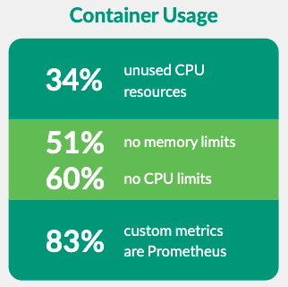

# Are you setting Limits to your Linux Containers?

You should be setting limits to your containers! I know the internet is full of quotes linking “setting limits” to uncreative attitude and bounderies to innovation, there is a known expression in my country; “Brazilians has no limits” to illustrate the curious and creative ways we use to solve problems in face of limitations, but we will see in this article that when it comes to Linux containers, it’s actually important to set resource limits.

By default there is no any mechanisms avoiding your containers to consume the all the memory available in your host, if a process is allowed to consume unlimited resources in your container, your cluster can quickly run out of Memory and CPU, disrupting your deployment thereby starving legitimate
applications. 

### In this article I will show you:

*	Setting limits to your containers is important.
*	Setting resource limits in Kubernetes. 
*	Implementing limits to your Containers with AWS Fargate.
*	Setting Memory And CPU Limits with Docker.

### Setting limits to your containers is important

By setting resource limits to your containers, you protect your environment to from attacks like [resource exhaustion attack](https://en.wikipedia.org/wiki/Resource_exhaustion_attack), improve efficiency in resources utilization, promote a more efficient resource allocation, and minimize costs. 

By applying limits to resource utilization for your containers you also improves visibility on how much memory and CPU the conainer process is demanding from the host operation system. In the Sysdig 2022 Cloud‑Native Security and Usage Report Sysdig shared some interesting finds based on the data gattered from the billions of containers their customers run over the course of a year and the ammount of workloads that does not limit resource utilization is surprising. 

> **“Many companies adopt cloud for operational efficiency, but more than half of containers deployed have no limits, which could waste resources” - Sysdig**

<p align="center">
  
  [1] Sysdig 2022 Cloud-Native Security and Usage Report
</p>
Limits can be implemented either reactively where the system intervenes once it sees a violation or by enforcement, the system prevents the container from ever exceeding the limit by terminating it. Different runtimes can have different ways to implement the same restrictions, in the following sections we will set limits using different methods for Kuberentes, Fargate and Docker. 


## Setting resource limits in Kubernetes

When you configure resource limits in Kubernetes and a process in the container tries to consume more than the allowed amount of memory, the system kernel terminates the process with an out of memory (OOM) error. The CPU limit defineshow much CPU time the container can use, during each scheduling interval the kernel checks to see if this limit is exceeded and waits before allowing the process to resume execution. The Kubernetes API allows you to limit cpu, memory, ephemeral storage and hugepages [2].

In the following example there is a Pod named **cloudguardian** that defines a container named **codescan**, the limit of 1 CPU and 256MiB of memory and a request of 0.5 CPU and 128Mib of memory. The request property defines the minimum ammount of resources the container must have in order to be triggered, this way the scheduler ensures the node where the container will be allocated has sufficient resourcers to run it, on the other hand limits will set the boundary of resource consumption by the container.


```
---
apiVersion: v1
kind: Pod
metadata:
  name: cloudguardian
spec:
  containers:
  - name: codescan
    image: nginx
    resources:
      requests:
        memory: "64Mi"
        cpu: "250m"
      limits:
        memory: "128Mi"
        cpu: "500m"
```

## Setting Memory And CPU Limits with Docker

It's possible to enforce Out Of **Memory** Exception and CPU allocation to Docker containers by setting runtime configuration flags of the docker run command [2]. To limit the maximum amount of memory the container can use to 256Mb you can set the parameters below:

```
-m or --memory=256m
```

If the container host Linux kernel detects there is not enough memory to perform important system functions, it throws an Out Of Memory Exception to kill process to free up memory for the host. It's possible to protect specific containers from being killed by the OOME by setting the **--oom-kill-disable on** on it, it will prevent Docker to kill your important application containers in a Out Of Memory Exception event.

The Completely Fair Scheduler - CFS is the one responsible for scheduling normal Linux processes in the Linux kernel. When you limit CPU resources for your container, you are sending a constraint to CFS to state the given container will have a hard limit to the host machine’s CPU cycles. There are several ways to limit CPU resource allocation to containers, but in general you want to use:

```
--cpus=<value>
```

Have a look at the Runtime options with Memory, CPUs, and GPUs documentation for more details on how to set limits to your Docker containers [2].

## Implementing limits to your Containers with AWS Fargate


## Conclusion 

In this article we have seen the importance of defining resources limits for your containers, the kind of problems the container environment can experience if resource quota utilization are not implace, we also saw three different methods to limit resource allocation and utilization by containers, in Docker, Fargate and Kubernetes. 

Now you are aware of the have security, performance and resource consumption inplications of not setting container resource utilization for your workload. It’s recommended that you set at least Memory and CPU limits when you run your container applications.

## Reference 
[1] https://sysdig.com/2022-cloud-native-security-and-usage-report
[2] https://kubernetes.io/docs/concepts/configuration/manage-resources-containers/
[3] https://docs.docker.com/config/containers/resource_constraints/
[4] https://docs.aws.amazon.com/AmazonECS/latest/developerguide/AWS_Fargate.html
